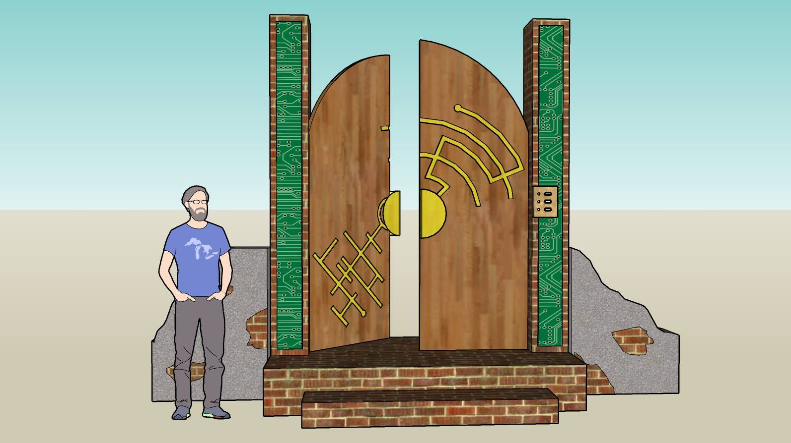

# liminal-entanglement

### Overview
This repository contains the source code for the Burning Man 2019 project, Liminal Entanglement.

### Project Info
- [Project Research](docs/research.md)
- [Project Design](docs/design.md)
- [Diagrams](docs/diagrams)
- [Images](images)

### Testing on Windows

1. Install [python 3.7.4](https://www.python.org/downloads/release/python-374/)
2. Install [Pip](https://pip.pypa.io/en/stable/installing/)
3. run `pip install wheel`
4. Download curses library matching your python version [here](https://www.lfd.uci.edu/~gohlke/pythonlibs/).
5. run `python -m pip install curses-2.2-cp34-none-win32.whl`
6. run `cd terminal`
7. run `python setup.py install` to install the required packages
8. Open powershell and execute the following to start the simulated flipdot:
  - `cd terminal\flipdot`
  - `python sim.py`
9. In a separate terminal, run `python terminal_main.py`